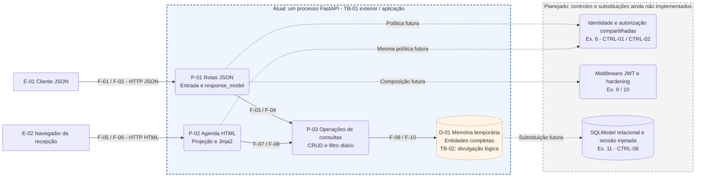

# Exercício 5 — Partições e arquitetura de segurança

> Baseline histórico do Ex. 5. A atualização do Ex. 6 ao final registra quais decisões passaram a implementação; tabelas anteriores documentam o planejamento original.

## 1. Escopo e baseline

O Exercício 5 exige particionar o sistema em componentes, mapear os fluxos entre eles e identificar vetores de ataque nos eixos **design, implementação e infraestrutura**. Este documento atende **R09**, localizando decisões e controles na arquitetura da própria aplicação.

**Baseline:** `e2f239badbaa6905ef32cdfe9423e0fa33b61065`, entrega do Exercício 4, inspecionada na branch `feat/ex04-stride-threat-model`. O estado executável permanece CRUD JSON, agenda HTML e memória temporária, sem autenticação ou banco relacional. Este incremento é documental.

Artefatos permanentes reutilizados: [CIA/DFD](cia-dfd.md), [DFD atual](dfd-atual.mmd), [threat model](threat-model.md), [requisitos](requisitos.md) e [decisões](decisoes.md). AT/P/F/TB/TM/CTRL/TEST mantêm seus IDs. Não foi necessário criar novas fronteiras atuais ou Threat IDs: a análise detalha onde tratar as ameaças já modeladas.

## 2. Partições e separação de responsabilidades

**Recomendação de engenharia:** manter uma aplicação modular no mesmo processo FastAPI. Particionar responsabilidades facilita revisão e centralização de controles; não exige microserviços, interfaces por operação ou repositórios genéricos. Nenhuma pasta fornece isolamento de segurança por si só.

| Partição / componente | Responsabilidade e localização atual | Recebe / envia | Fronteira e controle | Estado |
| --- | --- | --- | --- | --- |
| Composição | `app/main.py`: instancia FastAPI e inclui routers; futuro registro de middleware/dependências | Liga P-01/P-02 à aplicação | CTRL-01/07/11 futuros, sem concentrar política no ponto de entrada | Atual, controles futuros |
| P-01 — transporte JSON | `app/routes/consultas.py`: HTTP, status, parâmetros e coordenação; `app/models/consultas.py`: contratos | F-01/02 externos; F-03/04 com P-03 | TB-01 e divulgação TB-02; CTRL-03 implementado, CTRL-01/02/05 parciais/futuros | Atual |
| P-02 — apresentação HTML | `app/routes/agenda.py`, `app/templates/`: dia/fuso, projeção mínima e renderização; sem consultas no template | F-05/06 externos; F-07/08 com P-03 | TB-01/02; CTRL-04 implementado; identidade/escopo da recepção pendentes | Atual |
| P-03 — operações/dados | `app/database/consultas.py`: CRUD, leitura diária e conversão de horário | F-03/04/07/08; F-09/10 com D-01 | Sem fronteira de processo; regras e persistência devem preservar CTRL-02/05/08 | Atual, regras incompletas |
| D-01 — depósito | `app/database/memoria.py`: entidades, contador e lock | F-09/10, internos | TB-02 lógico; não autentica o chamador nem garante conflito de agenda; CTRL-08 futuro | Atual, temporário |
| Identidade/autorização | Futura camada `app/auth/`: credenciais, token, contexto de identidade e políticas compartilhadas | Solicitações humanas; recursos/vínculos necessários à decisão | CTRL-01/02; aplicar nas rotas JSON e HTML, sem política duplicada | Planejado Ex. 6 |
| Middleware | Futura camada `app/middleware/`: validação JWT centralizada, headers e abuso conforme incremento | Requisição/resposta, contexto de identidade validado | CTRL-01/07/11; ownership continua na política com acesso ao recurso | Planejado Ex. 9/10 |
| Configuração e banco | Futuros módulos em `app/database/` e configuração central: engine, sessão, SQLModel, credenciais via BaseSettings | Operações e sessão por requisição | CTRL-08; TB-04 só se banco estiver em outro processo; motor ainda a definir | Planejado Ex. 11 |
| Cliente parceiro | Futuro acesso de laboratório via Client Credentials | Somente disponibilidade; não informações de pacientes | TB-03 futura, CTRL-10; sem chamada de saída da API ao laboratório presumida | Planejado Ex. 7 |

Schemas são contratos transversais de P-01/P-03, não um serviço de rede. Identidade e políticas futuras serão funções/dependências coesas; o desenho não determina que cada linha da tabela exija um novo arquivo. Não criar diretórios vazios nesta etapa.

### Diagrama de partições

Fonte: [particoes-seguranca.mmd](particoes-seguranca.mmd). Exportação: [SVG](../evidencias/ex05/particoes-seguranca.svg) e [PNG](../evidencias/ex05/particoes-seguranca.png).

Linhas contínuas agrupam trocas **atuais** em pares de fluxo; a direção detalhada de ida e retorno permanece no DFD F-01–10. Linhas pontilhadas mostram **dependências/substituições planejadas**, sem afirmar tráfego ou controles existentes. A camada futura de middleware envolverá também HTML/erros; sua ligação com P-01 no desenho é referência de composição, não exclusão de P-02.

## 3. Fluxos e fronteiras revisadas

| Percurso | Fluxos reais e dados | Controle atual / lacuna | Local da decisão futura |
| --- | --- | --- | --- |
| Criar consulta | E-01 → P-01 → P-03 → D-01; F-01/03/09; paciente/profissional, data, motivo e notas | Tipos/limites; nenhum ator ou vínculo autenticado | Identidade compartilhada e CTRL-02 validam vínculo antes de gravar; ID do corpo não prova autor |
| Ler/alterar/remover por ID | F-01/03/09/10/04/02; objeto ou resultado; PATCH altera somente campos de seu schema | JSON reduz saída, sem impedir leitura/escrita indevida | Carregar o mínimo para decidir → política por recurso → operação/saída; negar antes de divulgar ou alterar |
| Listagem filtrada | F-01/03/09/10/04/02; conjunto de consultas | Filtro paciente/profissional é controlado pelo consumidor, sem escopo de autorização | Combinar filtro pedido com restrição obrigatória da identidade, antes da saída; não apenas esconder registros no cliente |
| Agenda diária | E-02 → P-02 → P-03 → D-01 e retorno; F-05/07/09/10/08/06 | Dia convertido, contexto mínimo e escape; sem comprovar recepcionista | Mesma identidade/política de CTRL-02 restringe conjunto antes de projeção e renderização |
| Falha de entrada/autorização | F-02/06 devolvem erros; entrada pode conter dados clínicos | Tratamento de erro sensível ainda a verificar | CTRL-09 sanitiza saída/logs com mensagens úteis; controles de rede também devem valer nos erros |

| Fronteira | Revisão arquitetural | Consequência |
| --- | --- | --- |
| TB-01 atual | Clientes externos versus processo FastAPI; inclui a recepção dita interna | Validar identidade, entrada e saída; não confiar em papel/ID fornecido, IP ou presença de frontend |
| TB-02 atual, lógica | Entidade completa versus contrato JSON/contexto HTML | `response_model` e projeção reduzem divulgação; acesso interno ao processo não é isolado pelo layout |
| TB-03 futura | Parceiro versus endpoints de token/disponibilidade | Autenticar cliente e limitar tipo/escopo/audiência; laboratório não obtém privilégio humano |
| TB-04 futura/condicional | Aplicação versus banco quando separado; SQLite no processo não cria a mesma fronteira de rede | Definir motor/topologia e controles de sessão/credencial/transação antes de alegar isolamento |

TLS/proxy serão parte da topologia de TB-01 se adotados; não há proxy implantado neste baseline. Não atribuir outro número de fronteira sem um componente e mudança de confiança concretos. JWT futuro não torna automaticamente os fluxos internos ou o navegador confiáveis.

## 4. Vetores nos três eixos de segurança

**Design** trata decisões de contrato, permissão e domínio. **Implementação** trata como o código cumpre essas decisões. **Infraestrutura** trata rede, processo, configuração e operação. Um Threat ID pode aparecer em mais de um eixo: a distinção aponta o responsável pelo controle, não duplica findings.

| Vetor / eixo | Cenário relevante e estado | Componente / fluxo / fronteira | Threat ID | Decisão / controle / verificação |
| --- | --- | --- | --- | --- |
| VD-01 — design | Papel ou ID isolado permite gerir paciente fora do vínculo; política ausente | P-01/P-03, F-01/03/09, TB-01 | TM-001/003/006 | CTRL-01/02: identidade + papel/atributo + recurso; TEST-04/07/08/17 futuros; matriz de vínculo a definir |
| VD-02 — design | Permissão unitária não cobre lista/agenda; vazamento por filtro/dia | P-01/P-02, F-02/06, TB-01/02 | TM-002/004 | CTRL-02/03/04: escopo do conjunto + mínima saída; TEST-09 futuro, TEST-02 histórico cobre somente campos |
| VD-03 — design | Regra de estado/duração/conflito indefinida permite agenda incoerente | P-03/D-01, F-09/10 | TM-006/009 | Decidir regra antes de disponibilidade; CTRL-05/08; TEST-12/16 após decisão, sem conflito alegadamente demonstrado |
| VD-04 — design | Token de parceiro confundido com humano ou admin ganha leitura clínica por nome do papel | Identidade/cliente futuros; TB-03 | TM-013/014 | CTRL-01/02/10; RBAC + vínculo como direção proposta, escopos M2M separados; TEST-06/10/11 futuros |
| VI-01 — implementação | Entrada parcialmente validada; status livre, extras não proibidos, IDs sem vínculo | Schemas/P-01/P-03, F-01/03 | TM-003/006 | CTRL-05/02: `extra='forbid'`, allowlists/regex pertinentes e semântica; TEST-12 parcial histórico/futuro; não presumir mass assignment |
| VI-02 — implementação | Retornar objeto inteiro ou desativar escape reintroduz exposição/XSS | P-01/P-02, F-04/08/02/06, TB-02 | TM-004/005 | CTRL-03/04 existentes; preservar TEST-02/03 históricos; nenhuma regressão vulnerável criada |
| VI-03 — implementação | Verificador JWT esquece expiração/claims, ou rota contorna política central | Auth/middleware futuros; F-01/05 | TM-001/002/003/013 | CTRL-01/02: validação única do token e decisão de recurso obrigatória; TEST-05/07/09/17 futuros |
| VI-04 — implementação | Erros refletem clínica e ações não deixam registro atribuível | P-01/P-02/P-03, F-02/06/09 | TM-007/011 | CTRL-06/09; política de auditoria/erro a definir; TEST-19/22 propostos, sem execução |
| VF-01 — infraestrutura | HTTP exposto permite observação/alteração de dados em trânsito | TB-01, F-01/02/05/06; topologia futura | TM-012 | CTRL-11: decidir TLS/proxy/origens; TEST-15 e inspeção de HTTPS futura; comando local HTTP não comprova ataque externo |
| VF-02 — infraestrutura | Memória volátil por worker e lock local dão perda/divergência após reinício | P-03/D-01, F-09/10 | TM-008/010 | CTRL-08/07: banco e limites coerentes com workers; TEST-20/21 futuros; sem teste concorrente/capacidade |
| VF-03 — infraestrutura | Segredo previsível ou credencial de banco exposta compromete futuros tokens/dados | Configuração/auth/banco futuros, TB-01/04 | TM-013/015 | CTRL-01/08: BaseSettings/.env sem credencial real no repositório/ZIP; inspeção de configuração futura e TEST-05/13; não há segredo real hardcoded encontrado |
| VF-04 — infraestrutura | Falta de limites, headers e revisão de exposição amplia abuso/exploração | Processo HTTP, SUP-05/06 e login futuro | TM-005/008/012/016 | CTRL-07/11: rate limiting login, CORS explícito e headers; TEST-14/15 futuros; política `/docs` a definir, não inventar proteção atual |

Os vetores são cenários de análise, não uma nova revisão de vulnerabilidades do Ex. 8 nem resultados de scanner. VF-03 depende da futura implementação: gestão de credenciais dá suporte à defesa contra TM-015, mas não substitui parametrização SQL.

## 5. Onde cada controle deve atuar

| Controle existente no modelo | Responsável lógico / momento | O que precisa impedir | Limite e teste |
| --- | --- | --- | --- |
| CTRL-01 — identidade | Auth compartilhada Ex. 6; middleware JWT Ex. 9 reutiliza a mesma validação | Credencial/token inválido virar identidade confiável | Bearer só extrai token; validar assinatura, algoritmo, claims e expiração; TEST-04/05/10 |
| CTRL-02 — permissão/ownership | Política compartilhada com recurso/vínculo e escopo; chamada por P-01/P-02 Ex. 6/9 | Identidade válida ler/gravar recurso sem direito, inclusive lista e agenda | Middleware não deduz vínculo da URL; TEST-06/07/08/09/11/17 |
| CTRL-03 — saída JSON | Schema de saída e declaração de resposta P-01 | Campos internos virarem contrato público | Implementado; TEST-02 histórico; não cobre todo erro |
| CTRL-04 — HTML | Projeção P-02 + Environment/templates | Expor clínica desnecessária ou interpretar texto como marcação | Implementado; TEST-03 histórico; sem `safe`, sem autorização implícita |
| CTRL-05 — entrada/domínio | Schemas na fronteira; regras coerentes em operações/persistência | Campo fora de contrato e estado/vínculo inválido | Parcial atual, expansão Ex. 9; TEST-08/12/16 conforme domínio |
| CTRL-06 — auditoria | Política de eventos com identidade/ação/alvo mínimo; armazenamento protegido a definir | Ação relevante sem atribuição suficiente | Recomendação de engenharia; TEST-19; não armazenar segredos/notas completas |
| CTRL-07 — abuso | Camada HTTP e limites de operação; contadores compatíveis com processos | Força bruta e consumo ilimitado de recursos | Login diferenciado Ex. 10; demais limites recomendados; TEST-14/20 |
| CTRL-08 — persistência | Engine/sessão injetada e transações/constraints em P-03 Ex. 11 | Query alterada, gravação parcial e violação de invariante definida | Banco real e rollback; TEST-13/16/21; mock não prova concorrência |
| CTRL-09 — erros | Tratamento HTTP/observabilidade com conhecimento do contexto | Respostas/logs exporem dado sensível ou detalhes internos | Recomendação de engenharia; TEST-22; preservar diagnóstico seguro de falhas inesperadas |
| CTRL-10 — M2M | Auth de cliente + autorização de disponibilidade Ex. 7 | Cliente parceiro adquirir poder humano ou dados de pacientes | Scopes/claims próprios; TEST-11; CORS não autentica cliente |
| CTRL-11 — rede | Infraestrutura TLS/proxy se escolhidos; composição de CORS/headers Ex. 10 | Exposição inadequada e perda de proteções em erros | TEST-15; HSTS exige HTTPS e proxy confiável; CORS não autoriza recurso |

A [documentação FastAPI sobre OAuth2PasswordBearer](https://fastapi.tiangolo.com/tutorial/security/first-steps/) esclarece seu papel inicial no bearer; a validação efetiva será centralizada no projeto. A [documentação SQLModel sobre sessão injetada](https://sqlmodel.tiangolo.com/tutorial/fastapi/session-with-dependency/) é a referência para o ciclo de sessão futuro. Essas referências não indicam implementação desses componentes neste baseline.

## 6. Decisões antecipadas e pendências antes do Ex. 6

**Recomendação de engenharia adotada — DEC-17:** separar identidade de permissão e compartilhar as políticas entre JSON e HTML. Usar RBAC para papéis internos e autorização por recurso/atributos para paciente vinculado, evitando duplicação por endpoint. A justificativa/contrato final de RBAC/ABAC deve ser consolidada no Ex. 6, após definir a matriz de acesso.

| Decisão | Direção / alternativas e critério | Quando e como concluir |
| --- | --- | --- |
| Vínculo paciente/profissional | **Decisão a definir:** relação explícita, fonte confiável e quem pode criá-la; IDs enviados não comprovam vínculo | Antes de implementar CTRL-02; caso permitido e cruzado verificáveis |
| Leitura clínica e administrativa | **Decisão a definir:** alcance por ator, dados mínimos da recepção e operações administrativas; não conceder acesso clínico irrestrito ao administrador | Matriz ator × operação × recurso antes do Ex. 6; registrar cenário autorizado/negado |
| Contrato JWT/MFA | **Decisão a definir:** subject, tipo, issuer/audience, claims obrigatórias, expiração, chave/configuração e desafio MFA simulado | Ex. 6, TEST-04/05/10; não emitir privilégio admin antes do fator |
| Autenticação da agenda no navegador | **Decisão a definir:** cliente que envia bearer em requisição controlada, ou sessão/cookie protegido para navegação HTML | Antes de proteger P-02. Navegação comum não acrescenta bearer automaticamente; cookie exige considerar CSRF, flags e encerramento de sessão. Não pôr token na URL |
| Middleware JWT e rotas públicas | Centralizar verificador, separar allowlist pública explícita e política de objeto; ordem com erros/CORS/headers a validar | Ex. 9/10; testes em sucesso, erro, sem token e preflight; não duplicar verificador do Ex. 6 |
| Disponibilidade M2M | **Decisão a definir:** duração, status, fuso definitivo e conflito; scopes mínimos e identidade de cliente separados | Antes do Ex. 7; TEST-11 e revisão da regra de horário |
| Banco e consistência | **Decisão a definir:** SQLite ou outro motor relacional, transações, constraints de conflito, migração/recuperação e topologia | Antes do Ex. 11; SQLModel obrigatório, TEST-13/16/21 no motor escolhido |
| TLS, origens e operação | **Decisão a definir:** host/proxy/certificado, origens CORS, hosts confiáveis, workers, exposição de documentação | Antes de exposição externa; não inferir configuração de produção a partir de localhost |

Os detalhes indefinidos permanecem pendências, não bloqueiam a entrega documental deste exercício. Se cookie/sessão ou nova fronteira forem escolhidos, reavaliar o threat model para ameaças adicionais antes de implementar; esta tabela não inventa um controle CSRF ou uma sessão já existente.

## 7. Revisão de percursos seguros planejados

Esta revisão é análise de design, sem execução de novas rotas autenticadas:

1. **Profissional cria consulta permitida:** token válido → identidade confiável → papel e paciente vinculado → entrada válida → operação/constraints → resposta filtrada. O `profissional_id` recebido é validado contra a política, sem assumir identidade do corpo.
2. **Outro profissional tenta PATCH/DELETE:** identidade pode ser válida; a política examina consulta/vínculo e nega antes da mutação. TEST-07/17 deve confirmar estado intacto e ausência de efeitos.
3. **Recepção abre agenda:** transporte de sessão/token definido → política de leitura da agenda → conjunto restrito → projeção mínima → escape. O dia/filtro solicitado não amplia o alcance. O fluxo atual ainda não faz essas duas primeiras decisões.
4. **Cliente usa token M2M no CRUD:** autenticidade do token não concede papel humano; política verifica tipo/audiência/scope e nega. Disponibilidade permitida não contém pacientes ou notas.
5. **Falha em gravação relacional:** transação/rollback conforme invariante; erro seguro sem credencial/SQL interno. Indisponibilidade de banco não vira falsamente 404 ou conflito de agenda.

Listagem, filtros, agenda HTML e futura disponibilidade não podem ser exceções implícitas à política. Nenhum desses percursos foi demonstrado como seguro por execução nesta etapa; testes devem ocorrer no incremento em que o componente existir.

## 8. Conclusão documental e evidências

- [x] Componentes atuais e planejados separados, com localização e responsabilidade.
- [x] Fluxos relacionados ao DFD e fronteiras reais/lógicas/futuras preservadas.
- [x] Doze vetores analisados nos três eixos com Threat IDs e verificação prevista.
- [x] CTRL-01–11 localizados na arquitetura e ligados ao catálogo TEST.
- [x] Decisões necessárias para autenticação HTML/JSON, M2M e persistência registradas.
- [x] REQ-05/R09 rastreados com fonte Mermaid, exportação e revisão.

[Evidências do Exercício 5](../evidencias/ex05/README.md) registram baseline, diagrama e verificações documentais. Testes JSON/XSS dos Ex. 1/2 continuam evidências históricas; não houve nova execução de pytest, scan, carga, autenticação ou banco. O documento não comprova liberação para produção.

## 9. Partições implementadas no Exercício 6

Identidade, senha, JWT, MFA e políticas agora estão em `app/auth/`; contratos em `app/models/identidades.py`, configuração em `app/settings.py`, cadastro/vínculos em `app/database/identidades.py`. As rotas JSON/HTML dependem do mesmo principal validado; a política decide papel e recurso antes de expor/mutar. Cadastro local e desafios não são serviços externos e não mudam o isolamento de processo.

As quatro primeiras decisões da seção 6 foram resolvidas em DEC-18: vínculo fictício confiável, matriz mínima aprovada, contrato JWT/MFA e cookie HttpOnly exclusivo de agenda. [Contrato completo](autenticacao-autorizacao.md) e [DFD atualizado](dfd-atual.mmd) registram a evolução. O diagrama `particoes-seguranca.mmd` permanece snapshot conceitual do Ex. 5; o DFD editável representa o incremento atual.

CTRL-01/02 passaram a implementados/verificados por pytest e reprodução HTTP; CTRL-12 trata transporte da sessão (TM-017). Middleware, laboratório, TLS/headers, rate limiting e banco continuam nos incrementos seguintes. Cenários de criação autorizada, acesso cruzado negado e recepção mínima foram exercitados no Ex. 6; M2M e falha relacional não foram executados.

## Partição de disponibilidade — Exercício 7

O parceiro agora cruza TB-03 por Basic/Client Credentials e bearer exclusivo, validado em P-04. P-06 acrescenta cálculo de intervalos e projeção mínima, com F-26–33 no DFD editável. P-03/D-01 permanecem no mesmo processo em memória. Exportações Ex. 3/5/6 são históricas e foram preservadas.

CTRL-10/TM-014/TEST-11 foram implementados/verificados; a agenda não se tornou pública nem o administrador ganhou acesso clínico. A disponibilidade pode revelar ocupação indiretamente, mas não paciente/motivo. Integridade da reserva, durabilidade, TLS e limites operacionais não são comprovados pelo cálculo. [Contrato e decisões](integracao-m2m.md), threat model 1.3 e evidências Ex. 7 registram o estado atual.

## Evolução — Exercícios 9/10

Middleware JWT centralizado estabelece principal, e políticas de recurso mantêm ownership antes de exposição/mutação. `app/network.py` envolve essa fronteira com headers, CORS e cota local de requisições; configurações e contador são preparados no lifespan. Não há novo serviço, frontend ou banco nesta evolução. Controles CTRL-01/02/05/07/11 têm regressões, com TLS, banco/concorrência e múltiplos workers ainda não demonstrados. [Correções](correcoes-entrada-saida.md) e [hardening](hardening.md) descrevem estado atual e limites.

## Atualização — Exercício 11

O estado atual substitui D-01 por SQLModel/SQLite local, com PK/FK/CHECK, sessão injetada, parâmetros vinculados, reserva transacional de escrita e conflito 409. CRUD, agenda e M2M leem o mesmo banco. TB-04 representa processo/arquivo sob permissões do SO, sem servidor de banco; a fonte atual é `docs/dfd-atual.mmd`. Seções anteriores e exportações descrevem os respectivos baselines históricos. [Persistência](persistencia.md) registra DEC-23, reinício verificado, rollback, concorrência e riscos residuais. Backup, auditoria persistente e deploy não foram comprovados.
