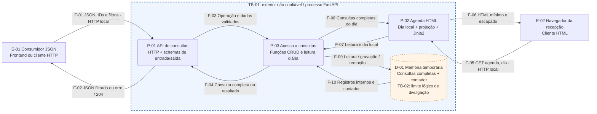

# Exercício 3 — CIA, referenciais e fluxo de dados

> Baseline histórico: as seções originais descrevem a aplicação do Ex. 3. O DFD editável agora representa o Ex. 6; a exportação histórica do Ex. 3 permanece preservada. A atualização abaixo prevalece para o estado atual.

## 1. Escopo e estado analisado

**Escopo do Exercício 3:** analisar a aplicação sob a tríade CIA, associar OWASP, NIST SSDF e MITRE a controles concretos existentes e construir um DFD com fronteiras de confiança e fluxos de dados sensíveis. A entrega atende **R05** (CIA e referenciais ligados a controles concretos) e **R06** (DFD, fronteiras e fluxos sensíveis). Não implementa autenticação, M2M ou persistência dos exercícios posteriores.

**Baseline:** commit `46db788b99a19b4cf145555e8e9ff679a88e29fe`, integração do Exercício 2, na branch `feat/ex03-security-foundations-dfd`. A análise parte do código de `app/`, dos testes e das evidências dos Exercícios 1 e 2. Os consumidores representam os contratos existentes, não um frontend já desenvolvido ou um papel efetivamente autenticado.

| Estado existente | Localização | Limite da afirmação |
| --- | --- | --- |
| CRUD RESTful de consultas | `app/routes/consultas.py` | Qualquer cliente pode chamar as rotas; não há autenticação/ownership |
| Schemas de entrada; tipos, alguns limites e rejeição de nulos no PATCH | `app/models/consultas.py` | Campos extras não são proibidos explicitamente; status livre; IDs não comprovam existência ou vínculo |
| Saída JSON com seis campos | `ConsultaResponse` e quatro operações JSON de consultas | Motivo e vínculo paciente/profissional continuam sensíveis e acessíveis sem autorização |
| Agenda diária com projeção mínima, herança e escape | `app/routes/agenda.py`, `app/templates/` | Agenda ainda acessível sem autenticação; IDs não equivalem a anonimização |
| Armazenamento e contador em memória com lock | `app/database/memoria.py`, `app/database/consultas.py` | Sem banco, backup, durabilidade, isolamento entre workers ou garantia de conflito de agenda |
| Execução local por Uvicorn em HTTP | `README.md`, evidências Ex. 1 | Não comprova TLS, capacidade, disponibilidade ou preparação para produção |

Os seeds fictícios de pacientes e profissionais existem em `memoria.py`, mas não são consultados pelas rotas. Não há CRUD desses recursos, login, JWT, papel administrativo efetivo, cliente laboratório, chamada externa, prontuário ou SQL no incremento atual. `/`, `/docs`, `/redoc` e `/openapi.json` são superfícies auxiliares; não consultam D-01. Documentação pública descreve contratos, não valida autorização.

## 2. Dados e ativos

| ID | Ativo / campos reais | Entrada / armazenamento / saída | Sensibilidade e cuidado |
| --- | --- | --- | --- |
| AT-01 | Vínculo: `id`, `paciente_id`, `profissional_id`, `data_hora`, `status` | JSON de entrada; D-01; JSON de saída; agenda com horário e IDs | Identifica agendamentos e associa pessoas a atendimento; não é dado público por usar números |
| AT-02 | Informação clínica: `motivo` | POST/PATCH; D-01; JSON; excluído do contexto HTML | Informação de saúde; precisa de autorização além do schema |
| AT-03 | Nota interna: `observacoes_internas` | POST/PATCH; D-01; ausente do JSON/HTML de sucesso | Pode conter informação clínica confidencial; excluir da saída não impede escrita indevida |
| AT-04 | Metadados: `criado_em`, `atualizado_em` e contador | Gerados internamente; D-01; datas excluídas das respostas | Datas não são trilha de auditoria: falta ator, ação e histórico; contador torna IDs previsíveis |
| AT-05 | Serviço, código e templates | Processo FastAPI, módulos e templates locais | Alteração indevida pode remover controles; queda ou reinício afeta agenda e dados |
| AT-06 | Evidências e testes fictícios | `tests/`, `evidencias/`, fora do fluxo de produção | Não usar dados reais; payload didático não é finding de ataque executado em produção |

Credenciais, tokens e disponibilidade M2M são ativos **futuros**, não dados atualmente recebidos ou armazenados. Os dados fictícios permitem demonstração local, mas não eliminam os riscos do contrato quando ele receber dados reais. Esta análise não comprova conformidade LGPD.

## 3. Tríade CIA aplicada

C significa confidencialidade: quem pode conhecer o dado. I significa integridade: quem pode alterá-lo e quais invariantes devem permanecer verdadeiras. A significa disponibilidade: conseguir usar o serviço e recuperar dados quando necessário. As propriedades são analisadas por cenário; não há percentuais, metas de latência ou SLAs definidos pelo Assessment.

| ID | Ativo / propriedade | Cenário de falha e consequência | Controle atual | Verificação e lacuna |
| --- | --- | --- | --- | --- |
| CIA-01 | AT-03/04 — C | Retornar entidade interna completa revela notas e auditoria ao consumidor | `ConsultaResponse` exclui três campos em POST/GET/lista/PATCH | TEST-02 e JSON Ex. 2; cobre saída de sucesso, não autorização nem todos os erros |
| CIA-02 | AT-01/02 — C | Cliente sem identidade lê consulta por ID/listagem ou agenda e conhece atendimento | Minimização da agenda reduz os campos; **nenhum controle de acesso atual** | Inspeção das rotas confirma ausência de dependência de identidade; autorização prevista Ex. 6, M2M Ex. 7 |
| CIA-03 | AT-01/05 — C/I | Texto malicioso armazenado em status vira marcação ativa na agenda, podendo afetar sessão/página da recepção | Auto-escape Jinja2, sem `safe`, e contexto mínimo | TEST-03 com script e imagem/handler; protege contexto HTML usado, não qualquer contexto JavaScript/CSS |
| CIA-04 | AT-01/02 — I | Entrada ausente/incompatível ou PATCH com nulo invalida campos obrigatórios | Pydantic, `gt`, limites de motivo/notas e validator de nulos | Teste de PATCH nulo e data inválida; validação semântica de vínculo, catálogo de status e `extra='forbid'` ainda ausentes |
| CIA-05 | AT-01/03 — I | Cliente altera/deleta consulta alheia ou escreve notas internas indevidamente | **Nenhuma autenticação ou autorização atual** | Rotas e schemas permitem acesso sem identidade; Ex. 6 precisa validar recurso e vínculo, não apenas papel |
| CIA-06 | AT-01/04 — I | Acesso concorrente ao dicionário/contador causa atualização inconsistente | `_lock` envolve operações em memória | Inspeção do código; não foi realizado teste concorrente e não há garantia de conflito de intervalos nem coordenação entre processos |
| CIA-07 | AT-01/05 — A | Reinício elimina consultas; workers independentes veem estados diferentes | Memória simplifica demonstração, **sem durabilidade/recuperação** | Característica estrutural de D-01; Ex. 11 precisa decidir banco/recuperação, sem prometer backup já existente |
| CIA-08 | AT-05 — A | Muitas escritas/listagens sem paginação consomem memória e CPU; lock pode serializar operações | Alguns limites de campos evitam parte das entradas excessivas | Não há quota, rate limiting ou limite de registros; capacidade não medida; hardening Ex. 10 e limites a definir |

**Recomendação de engenharia:** priorizar leitura/escrita indevida de dados de saúde antes de otimizações. Escape e schema são defesas parciais; não permitem liberar a aplicação atual para dados reais. Disponibilidade e integridade exigem decisões sobre duração, conflitos, estados e recuperação antes de garantias de agendamento.

## 4. DFD do incremento atual

O diagrama representa dados em trânsito e em repouso. Retângulos são entidades externas, nós arredondados são processos lógicos e cilindro é depósito. Setas indicam direção e ID do fluxo; não são uma sequência obrigatória de execução. Todos os processos P-01 a P-03 estão no **mesmo processo Python**, sem microserviços ou rede entre módulos.

Fonte editável: [dfd-atual.mmd](dfd-atual.mmd). Exportação legível e procedimento: [evidências do Exercício 3](../evidencias/ex03/README.md).

### Componentes

| ID | Tipo e responsabilidade | Correspondência real |
| --- | --- | --- |
| E-01 | Consumidor JSON, incluindo qualquer cliente HTTP | Contrato de `/consultas`; papéis futuros não são identidade verificada |
| E-02 | Navegador que solicita agenda da recepção | Contrato de `/agenda`; não existe sessão autenticada nesta fase |
| P-01 | HTTP CRUD, validação de entrada e serialização de saída | `app/routes/consultas.py`, schemas em `app/models/consultas.py`; serialização pelo FastAPI |
| P-02 | Dia/fuso, leitura diária, projeção e renderização HTML | `app/routes/agenda.py`, `base.html`, `agenda.html` |
| P-03 | Operações CRUD e leitura de consultas do dia | `app/database/consultas.py`; regra de fuso provisória `America/Sao_Paulo` |
| D-01 | Consultas completas e contador em memória | `_consultas`, `_contador_consultas`, `_lock` em `memoria.py` |

### Fluxos e dados sensíveis

| Fluxo | Origem → destino | Dados e forma | Fronteira / proteção atual |
| --- | --- | --- | --- |
| F-01 | E-01 → P-01 | HTTP: JSON com IDs, data/hora, motivo, notas; URL com ID/filtros | TB-01; validação parcial de entrada; sem TLS no comando local, autenticação ou ownership |
| F-02 | P-01 → E-01 | HTTP: seis campos JSON, erros ou 204 sem corpo | TB-01 e limite lógico TB-02; `ConsultaResponse` filtra sucesso; não aplicar a mesma afirmação aos erros |
| F-03 | P-01 → P-03 | Chamada Python: modelo de entrada ou ID/filtros/operação | Sem travessia de isolamento; dados tipados continuam controlados pelo solicitante |
| F-04 | P-03 → P-01 | Consulta completa, lista, `None` ou resultado de remoção | TB-02 lógico: P-01 deve filtrar dados internos antes de F-02 |
| F-05 | E-02 → P-02 | HTTP GET: `dia` opcional; nunca identidade da recepção comprovada | TB-01; parsing de date; default do dia no fuso local |
| F-06 | P-02 → E-02 | HTTP HTML: IDs, horário, status e dia; texto escapado | TB-01/TB-02 lógico; sem motivo/notas; navegador interpreta HTML, exigindo escape de texto variável |
| F-07 | P-02 → P-03 | Chamada Python com dia local para leitura | Sem isolamento; filtro de dia não é filtro de autorização |
| F-08 | P-03 → P-02 | Lista de entidades completas do dia, em ordem local | TB-02 lógico: projeção em P-02 elimina campos antes de entregar contexto ao Jinja2 |
| F-09 | P-03 → D-01 | Acesso Python: busca, inserção, alteração/remoção e contador | Mesmo espaço de memória; operações sob lock; sem SQL/credenciais |
| F-10 | D-01 → P-03 | Registros completos com notas, motivo, auditoria e IDs | Mesmo processo; instanciados como `Consulta`; lock não limita quem está autorizado |

Erros de validação são um fluxo de saída relevante em F-02/F-06: a representação padrão pode incluir partes da entrada inválida. **Lacuna a verificar antes de dados reais:** impedir reflexão de valores sensíveis e logs indevidos de payloads, sem declarar que a filtragem de respostas de sucesso cobre os erros. Não foi executado experimento de erro com dado clínico nesta etapa.

### Fronteiras de confiança

| ID | Lados separados e motivo | Controle necessário / estado |
| --- | --- | --- |
| TB-01 | Consumidores externos versus processo FastAPI. Nome “interno” da recepção não torna navegador/entrada confiáveis | Validar entrada/saída; hoje schema e escape. Identidade, ownership, escopos, TLS e controle de abuso ainda ausentes |
| TB-02 | Entidade interna completa versus contrato JSON/contexto HTML. É um **limite lógico de divulgação**, não barreira de sistema operacional ou conexão de banco | Allowlist JSON e projeção HTML existentes; qualquer módulo do processo com acesso ao depósito continua privilegiado. O contorno do depósito indica a origem dos dados internos; a redução efetiva ocorre em P-01/P-02 |
| TB-03 — futura | Laboratório parceiro versus API de disponibilidade, ainda sem fluxo real | Ex. 7 introduzirá identidade M2M e escopo mínimo; não desenhar laboratório consumindo dados clínicos como funcionalidade existente |
| TB-04 — futura | Processo API versus banco relacional, caso executado separadamente | Ex. 11: SQLModel, sessão por requisição, queries parametrizadas e configuração. Banco/motor e topologia ainda não definidos |

O retorno F-06 cruza TB-01 no sentido de saída: dado originalmente não confiável passa a ser interpretado em um navegador. Auto-escape preserva a distinção entre texto e marcação, mas não autentica o receptor. Não há hoje fronteira de sessão, emissor de JWT, proxy TLS ou serviço externo implantado.

### Percursos revisados no código

1. **Criação JSON:** F-01 → P-01 (`ConsultaCreate`) → F-03 → P-03 (`criar_consulta`) → F-09/D-01; retorno F-10/F-04 → P-01 (`ConsultaResponse`) → F-02. Notas internas entram e ficam em D-01, mas não constam da resposta de sucesso.
2. **Leitura HTML:** F-05 → P-02 → F-07 → P-03 (`listar_consultas_do_dia`) → F-09/D-01/F-10 → F-08; P-02 reduz campos, aplica templates e devolve F-06. O filtro converte o horário para o fuso da clínica antes de escolher o dia.
3. **Texto malicioso armazenado:** PATCH em F-01 grava status em D-01; a leitura por F-08 contém o texto original. A renderização de F-06 o apresenta como texto escapado. As evidências Ex. 2 mostram esse percurso em memória isolada.

## 5. Referenciais associados a controles concretos

**Decisão de engenharia DEC-15:** fixar edições para manter IDs comparáveis: OWASP Top 10 **2021**, OWASP API Security Top 10 **2023** como complemento, NIST SSDF **1.1 / SP 800-218**, e MITRE **CWE 4.20** conforme páginas consultadas. A edição 2021 é um recorte deliberado, não uma afirmação de ser a mais recente; o Assessment não determina edição. Uma troca futura exige remapeamento explícito. CWE é catálogo de fraquezas; não é ATT&CK, scanner ou certificação. SSDF organiza práticas do desenvolvimento, não classifica findings por severidade.

O mapeamento abaixo é uma **análise aplicada ao projeto**, não declaração de atendimento integral aos referenciais.

| Referencial / item | Controle existente e justificativa | Código / evidência | Limitação |
| --- | --- | --- | --- |
| [OWASP API3:2023 — propriedades do objeto](https://api-security.owasp.org/editions/2023/en/0xa3-broken-object-property-level-authorization/) | Allowlist da resposta e projeção HTML reduzem exposição de propriedades internas | `ConsultaResponse`, rota agenda; TEST-02 e comparação JSON Ex. 2 | Redução de exposição não implementa autorização de leitura/escrita por propriedade |
| [OWASP A03:2021 — Injection](https://top10.owasp.org/2021/A03_2021-Injection/) | Auto-escape evita interpretar texto armazenado como HTML ativo; validação limita parte das entradas | Environment da agenda e templates; TEST-03 com dois payloads | XSS integra A03 nesta edição; não existe SQL atual e não foi comprovada defesa de SQL injection |
| [NIST SSDF 1.1 — PW.5.1](https://nvlpubs.nist.gov/nistpubs/SpecialPublications/NIST.SP.800-218.pdf) | Validação, filtragem e encoding são práticas de codificação segura aplicadas às fronteiras | Schemas, rotas e templates Ex. 1/2 | Parcial: falta autorização e validação estrita |
| NIST SSDF 1.1 — PW.8.2, mesma publicação | Testes de contratos e XSS com resultados preservados | `tests/test_respostas_templates.py`, `evidencias/ex02/pytest_output.txt` | Não cobre todas as ameaças; expansão derivada do STRIDE no Ex. 12 |
| NIST SSDF 1.1 — PW.1.2, mesma publicação | Requisitos, decisões e riscos mantidos em documentos versionáveis | `docs/requisitos.md`, `docs/decisoes.md`, `docs/rastreabilidade.md` e este relatório | Registro existente não demonstra implantação integral do SSDF |
| [MITRE CWE-79 — XSS](https://cwe.mitre.org/data/definitions/79.html) | Escape de saída evita ativação dos payloads HTML testados | P-02; TEST-03, HTML e screenshot Ex. 2 | Defesa dos contextos usados; nenhum bypass demonstrado no estado atual |
| [MITRE CWE-200 — exposição sensível](https://cwe.mitre.org/data/definitions/200.html) | Filtragem de campos e minimização reduzem divulgação interna | P-01/P-02; TEST-02 e contexto verificado | Exposição de dados clínicos sem controle de acesso permanece; categoria ampla não substitui causa específica |
| [MITRE CWE-20 — validação inadequada](https://cwe.mitre.org/data/definitions/20.html) | Campos tipados, limites e bloqueio de nulos reduzem estados inválidos | Schemas, teste PATCH nulo e agenda com data inválida | Não comprova integridade referencial, ownership ou whitelist de status |

### Lacunas e próximo incremento

| ID | Lacuna registrada e vínculo CIA/DFD | Controle futuro / momento |
| --- | --- | --- |
| LAC-01 | Acesso sem identidade e autorização; CIA-02/05, TB-01, F-01/02/05/06 | Ex. 6: identidade, ownership e permissões também nas listas/HTML. Relaciona-se a [OWASP A01:2021](https://top10.owasp.org/2021/A01_2021-Broken_Access_Control/) e [API1:2023 BOLA](https://api-security.owasp.org/editions/2023/en/0xa1-broken-object-level-authorization/); [CWE-639](https://cwe.mitre.org/data/definitions/639.html) será avaliado no cenário de chave manipulada, sem afirmar hoje um teste de paciente autenticado |
| LAC-02 | Schema parcial e status livre; CIA-04, F-01 | Ex. 9: `extra='forbid'`, whitelist/regex e validação semântica conforme decisões |
| LAC-03 | Ausência de rate limiting e limites de registros; CIA-08 | Ex. 10: limite de login diferenciado; limites de volume/listagem precisam de decisão adicional |
| LAC-04 | Memória volátil e regras de conflito ausentes; CIA-06/07, D-01 | Ex. 11: banco relacional, invariantes/transações e decisões de recuperação |
| LAC-05 | Sem identidade M2M, TLS demonstrado, headers ou CORS explícito | Ex. 7/10/11 conforme controle; HTTPS/topologia de deploy a definir |
| LAC-06 | Erros potencialmente refletem dados; datas não comprovam auditoria | Revisão de tratamento de falhas e auditoria conforme threat model; não registrar payload clínico completo |

Esses IDs são **lacunas**, não Threat IDs nem findings do ZAP. O Exercício 4 reutilizará AT-01–06, P-01–03, F-01–10 e TB-01/02 para misuse cases e STRIDE, atribuindo então IDs de ameaça. Banco, JWT e laboratório atualizarão o DFD quando efetivamente introduzidos; o estado atual deve permanecer recuperável nas evidências/Git.

## 6. Verificação e critérios de conclusão

Foi realizada inspeção documental e do código: cada controle tem localização, cada fluxo tem origem/destino/dados e os percursos JSON/HTML correspondem às funções existentes. As provas HTTP/pytest da implementação são as evidências já executadas dos Ex. 1 e 2; este incremento documental não exige repetir a suíte ou criar testes de existência de arquivos Markdown.

- [x] Confidencialidade, integridade e disponibilidade analisadas com consequências concretas.
- [x] DFD distingue entidades, processos e memória temporária.
- [x] Fluxos com dados de pacientes e fronteiras reais/lógicas identificados.
- [x] OWASP, NIST SSDF e MITRE associados a controles existentes, com versões e limites.
- [x] Lacunas separadas de implementação e de ameaças ainda não modeladas.
- [x] R05/R06 ligados à documentação e aos artefatos de evidência.

Renderização/exportação do DFD e revisão do incremento estão registradas em [evidencias/ex03/README.md](../evidencias/ex03/README.md). Não foi executado scan, teste de carga, teste concorrente ou auditoria de produção. A análise identifica riscos do estágio atual, não autoriza deploy nem demonstra conformidade regulatória.

## 7. Continuidade no Exercício 4

O [threat model STRIDE](threat-model.md) reutiliza este inventário e o mesmo DFD. LAC-01 → TM-001/002/003, LAC-02 → TM-006, LAC-03 → TM-008/016, LAC-04 → TM-009/010, LAC-05 → TM-012/013/014 e LAC-06 → TM-007/011. TM-004/005 acompanham regressões dos controles existentes; TM-015 trata SQL futuro. Essas relações não mudam retroativamente o estado ou as evidências do Exercício 3.

## 8. Partições e controles no Exercício 5

[Arquitetura de segurança](arquitetura-seguranca.md) localiza os controles nas partições e analisa design, implementação e infraestrutura. O DFD atual não mudou: os fluxos F-01–10 e TB-01/02 permanecem no mesmo processo. Identidade, middleware, M2M, TLS e banco continuam planejados; TB-03/04 só serão concretizadas conforme implementação/topologia. O diagrama de partições agrupa pares de fluxo e usa linhas pontilhadas para plano futuro, sem substituir as direções detalhadas deste DFD.

## Atualização de CIA e fronteiras — Exercício 6

Confidencialidade: consultas exigem identidade, papel, ownership e vínculo; agenda somente para recepção, ainda minimizada. Integridade: criação e mutação verificam identidade/vínculo antes de gravar. Disponibilidade: desafios limitados a um por conta e expiração; não há limite global de requisições, durabilidade ou garantia entre workers.

`dfd-atual.mmd` adiciona P-04 identidade/JWT/MFA, P-05 políticas, D-02 contas/vínculos confiáveis e D-03 desafios, preservando P-01–03/D-01/F-01–10. F-11–25 representam consulta de identidade/estado, decisão de acesso e transporte de credenciais/sessão. P-05 lê o alvo para verificar propriedade antes de P-01 expor ou alterar; ler internamente o recurso não equivale a autorizá-lo para o cliente.

**Novo ativo AT-07:** hashes, chave de assinatura, tokens e fator simulado, de alta sensibilidade. D-02 provém de arquivo local restrito e seeds confiáveis; não há entrada HTTP de papéis/vínculos. D-03 é volátil. TB-01 continua exterior/processo; TB-02 continua divulgação lógica, sem isolamento de processo. A validação/política transforma entrada não confiável em principal autorizado dentro do mesmo processo; não é nova fronteira de rede. TB-03 (laboratório) e TB-04 (banco relacional) continuam futuras. Cookie é novo transporte na TB-01, avaliado em TM-017.

[Contrato e limites](autenticacao-autorizacao.md), [threat model 1.2](threat-model.md) e [evidências reais](../evidencias/ex06/README.md) registram os controles atuais. Não há TLS, ZAP, conformidade regulatória ou liberação para produção demonstrados.

## Atualização de fronteira e dados — Exercício 7

O parceiro agora cruza TB-03 por Basic/Client Credentials e bearer exclusivo, validado em P-04. P-06 acrescenta cálculo de intervalos e projeção mínima, com F-26–33 no DFD editável. P-03/D-01 permanecem no mesmo processo em memória. Exportações Ex. 3/5/6 são históricas e foram preservadas.

CTRL-10/TM-014/TEST-11 foram implementados/verificados; a agenda não se tornou pública nem o administrador ganhou acesso clínico. A disponibilidade pode revelar ocupação indiretamente, mas não paciente/motivo. Integridade da reserva, durabilidade, TLS e limites operacionais não são comprovados pelo cálculo. [Contrato e decisões](integracao-m2m.md), threat model 1.3 e evidências Ex. 7 registram o estado atual.
