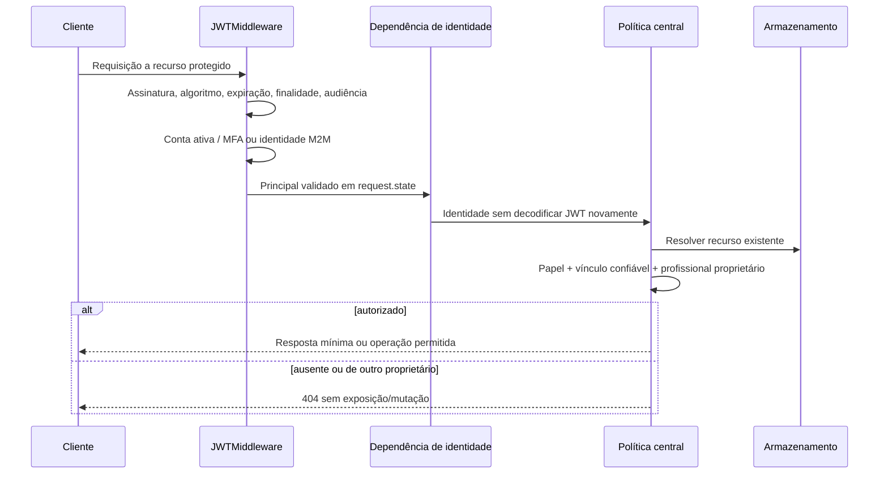

# Exercício 9 — Correções de entrada, saída e autorização

Este relatório registra o estado ao fim do Ex. 9. A última seção descreve a evolução no Ex. 10; prevalece sobre o estado histórico dos findings de hardening.

## 1. Resultado e limites

A API rejeita campos extras em criação e atualização de consultas e no formulário Client Credentials, restringe status a `agendada`, `cancelada` e `realizada` e valida o formato de username no login. O middleware ASGI estabelece identidade humana ou M2M uma vez por requisição. As políticas centralizadas verificam papel, vínculo confiável e ownership antes de acessar os dados. A agenda mantém herança, projeção mínima e auto-escape Jinja2.

**Decisão aprovada:** SQLite em memória somente em DEMO-002 para demonstrar SQL Injection antes/depois; a aplicação continua em memória até a migração SQLModel do Ex. 11. Estados e regex de username foram aprovados como regras do projeto, não apresentados como catálogo obrigatório da disciplina.

**Pendências acadêmicas:** o código real não tinha SQL ou XSS explorado; o papel paciente não existe no produto. Experimentos isolados não comprovam correção de vulnerabilidades SQL/XSS encontradas na aplicação. O enquadramento acadêmico dos cenários isolados continua pendente. VUL-002 (headers) e VUL-003 (throttling) permanecem abertos para Ex. 10; portanto a exigência ampla de corrigir todos os findings do Ex. 8 ainda não está integralmente concluída. Não liberar externamente com base neste incremento.

## 2. Contratos e validação

| Entrada | Controle efetivo | Positivo | Negativo | Arquivo |
| --- | --- | --- | --- | --- |
| POST consultas | `extra='forbid'`, IDs positivos, limites existentes de texto | Entrada permitida → 201 | `papel=administrador` → 422, nenhuma criação | `app/models/consultas.py` |
| PATCH consultas | `extra='forbid'`, atualizações somente dos quatro campos declarados | Motivo/notas/data/status permitidos → 200 | IDs, papel, auditoria ou outro extra → 422, estado intacto | Mesmo módulo |
| Status PATCH | `Literal` dos três estados, nulo explícito rejeitado | Três estados → 200 | Desconhecido, caixa diferente, vazio, script, nulo → 422 | `ConsultaUpdate` |
| Username no login | `fullmatch` de `[a-z0-9_]{1,64}` | Conta fictícia registrada → token | Acento, quebra de linha, espaço, operador SQL, >64 → 422 | `models/identidades.py`, `routes/auth.py` |
| Formulário Client Credentials | `M2MTokenInput.extra='forbid'`, somente grant_type/scope | Basic válido e grant correto → 200 | Papel, client_id/client_secret no corpo ou paciente → 422, sem token | `models/identidades.py`, `routes/auth.py` |
| Motivo e notas | Texto livre limitado, sem regex clínica arbitrária | Acentos, apóstrofo e pontuação preservados | Ausência/nulo/limites continuam conforme schema | `models/consultas.py` |

O contrato de login humano permanece formulário OAuth2. Regex é aplicada após a leitura do formulário; o OpenAPI gerado pela dependência padrão não publica automaticamente essa regex. Não alegar alinhamento completo do schema com esse controle. Extras do formulário humano não foram globalmente proibidos. A rejeição aplica-se aos modelos JSON de consultas, ao MFA já estrito e ao formulário M2M. Neste último, Basic continua obrigatório, `grant_type` errado retorna erro OAuth 400, ausente retorna 422 e scope vazio não recebe privilégio padrão.

Campo omitido no PATCH significa “não alterar”; `null` explícito para data/status/motivo falha. Notas internas podem ser apagadas com `null`. A atualização vazia mantém o comportamento anterior. Tipos numéricos continuam com as coerções Pydantic preexistentes; esta etapa não implementa `strict=True` global.

Não proibir aspas/acentos no motivo para tentar resolver SQL Injection: texto com aparência SQL pode ser dado legítimo. Quando houver SQL na aplicação, a defesa será parametrização de valores. Nenhuma senha, token ou credencial real entra nos arquivos ou ZIP.

## 3. Middleware JWT e ownership integrados

`app/auth/middleware.py` é ASGI puro e não consome o corpo. Protege segmentos `/consultas`, `/agenda`, `/admin`, `/auth/agenda-session` e `/disponibilidade`, incluindo subcaminhos. Raiz, documentação, login humano/MFA e concessão M2M continuam públicos no sentido de não exigir JWT; seus controles próprios de credenciais/desafio permanecem.

Bearer humano e M2M reutilizam os validadores existentes, sem mudar algoritmo/claims/expiração. O laboratório é identificado no middleware e seus scopes são verificados pela dependência `laboratorio` antes de executar disponibilidade. `/auth/m2m/token` continua com Basic, sem exigir bearer. Cookies são aceitos exclusivamente na agenda; cabeçalho Authorization presente e inválido não cai para cookie válido. Não há cookie nas rotas clínicas/admin/M2M.

O middleware **não presume ownership pela URL**. `consulta_autorizada` resolve o objeto e valida o vínculo/profissional em `app/auth/policies.py`; GET/PATCH/DELETE invocam a mesma política. Criação verifica os vínculos recebidos; listagem filtra o conjunto autorizado. JWT válido de outro profissional ainda recebe 404. MFA/papel e scopes continuam necessários e não são substituídos pela assinatura do token.

**Regra para evolução:** ao acrescentar recurso protegido fora dos segmentos existentes, atualizar o middleware e testar identidade/autorização. Dependências sem principal estabelecido negam 401 em vez de validar outro token ou permitir acesso. O middleware roda antes da injeção FastAPI; testes que alteram configuração precisam ajustar também sua fonte de settings, não apenas `dependency_overrides`. Preflight CORS será tratado pelo middleware CORS externo no Ex. 10; não há exceção de autenticação genérica para OPTIONS nesta etapa.

## 4. Comparação de ataques

| ID / cenário | ANTES preservado | Mesmo ataque | CORREÇÃO / defesa | DEPOIS verificado | Limite |
| --- | --- | --- | --- | --- | --- |
| VUL-001 | Snapshot histórico real: GET/PATCH por ID sem identidade → 200 | GET/PATCH `/consultas/1` sem token | Middleware JWT + políticas do Ex. 6 | 401; profissional diferente válido → 404; dono continua 200 | Autorização já existia desde Ex. 6; paciente só didático |
| OBS-001 | Baseline Ex. 8: POST com `papel=administrador` → 201, extra ignorado | Mesmo campo/payload | `ConsultaCreate.extra='forbid'` | 422, sem criar consulta | Não havia elevação de papel demonstrada |
| Endpoint adicional | PATCH não era o endpoint de OBS-001; schema também ignorava extras por padrão | PATCH com papel/IDs e motivo | `ConsultaUpdate.extra='forbid'` | 422 e estado inalterado | Histórico contém PATCH para BOLA; este é um padrão/achado diferente |
| OBS-006 / endpoint adicional aprovado | Snapshot real do baseline Ex. 8: `/auth/m2m/token` com Basic válido e extra `papel` → 200 | Mesmo formulário grant_type/papel e credenciais fictícias equivalentes | `M2MTokenInput.extra='forbid'` | 422; controle sem extra permanece 200 | Ignorar papel não elevava privilégio; endpoint constava no inventário, mas não em finding de extras |
| OBS-002 / TM-005 | Ex. 8: script no status → 200; HTML já escapado | `` | Allowlist na entrada + auto-escape preexistente | PATCH → 422; legado inserido no teste → HTML com texto escapado | Não existiu XSS explorado no antes real |
| DEMO-001 | Dois pacientes autenticados no experimento Ex. 8: ID alheio → 200 | Mesmo token de cada paciente; somente ID trocado | Comparar paciente do recurso com claim autenticado, no experimento corrigido | Próprio → 200; alheio → 404 | Sem portal no produto; equivalência dos atores/claims, chaves efêmeras novas |
| DEMO-002 / TM-015 | SQL intencionalmente concatenado apenas no experimento | `1 OR 1=1` | `WHERE paciente_id = ?`, valores separados | Antes IDs 1/2; depois vazio; controle paciente 1 retorna somente ID 1 | SQL da aplicação permanece não verificado até Ex. 11 |

### Endpoint adicional: justificativa precisa

O Ex. 8 descreveu o campo extra no **POST**, não testou o mesmo defeito de contrato no **PATCH**. Ambos ignoravam campos não declarados; o padrão foi corrigido nos dois schemas. PATCH, contudo, já havia sido citado para BOLA.

**Alternativa aprovada pelo responsável:** corrigir também `/auth/m2m/token`, antes não citado como finding de extras. O formulário ignorava campos não declarados, o mesmo comportamento externo de OBS-001, embora usasse Form em vez de schema JSON. A reprodução carrega o snapshot real verificado por SHA-256 em processo separado e confirma 200 com `papel=administrador`; após o modelo de formulário estrito, o mesmo extra retorna 422. Não houve promoção para administrador no baseline anterior.

Todos os endpoints estavam no inventário do Ex. 8. A interpretação literal de “nunca citado” permanece pendente; a expansão para endpoint não citado **como vulnerável por este padrão** foi autorizada e executada. Não criar nova funcionalidade ou vulnerabilidade artificial para contornar o texto. SQL/BOLA didáticos permanecem fora da aplicação e da suíte normal.

## 5. Saída HTML e regressões

O ambiente Jinja2 de `app/routes/agenda.py` usa `select_autoescape` para HTML/XML, herança e nenhuma marcação `safe`. Projeção HTML contém somente IDs/horário/status. A allowlist impede novos scripts no status, mas não substitui escape de dados legados. Os testes colocam script e imagem/onerror diretamente no armazenamento fictício e verificam texto escapado e ausência de tags ativas com parsing HTML. Nenhum conteúdo clínico foi acrescentado ao template para demonstrar XSS.

`app/errors.py` centraliza 422 e publica somente localização, tipo e mensagem; remove `input`, contexto e corpo. Testes JSON/Form confirmam que valores sensíveis fictícios enviados em campos extras não retornam na resposta (TM-011/CTRL-09/TEST-22). Não registrar payload clínico real em logs; revisar futuras mensagens customizadas para não interpolar valores sensíveis. Esse handler não mascara exceções inesperadas nem comprova sanitização de todas as falhas possíveis. Autorização não comprova constraint ou transação relacional; memória e corrida entre resolução/mutação continuam riscos para a persistência.

## 6. Testes e rastreabilidade

| Threat / teste estável | Verificação | Evidência |
| --- | --- | --- |
| TM-001/013/016, TEST-04/05/06/10 | JWT inválido/expirado/claims/finalidade, MFA e papel administrativo continuam negados | Suíte `test_autorizacao.py` |
| TM-002/003, TEST-07/08/09 | Ownership e vínculo em criação/lista/objeto; estado protegido; JWT validado uma vez | `test_seguranca_entrada_saida.py`, testes anteriores, HTTP reproduzido |
| TM-006/011, TEST-12/22 | Extras em POST/PATCH/M2M, nulos, status, username e resposta 422 mínima; positivos preservados | Novos 31 casos e suíte anterior |
| TM-005, TEST-03 | HTML legado escapado, entrada de status rejeitada | `test_respostas_templates.py`, `agenda-legado.html` |
| TM-014, TEST-11 | M2M conserva audience/type/scope, negação de cruzamento, desativação e disponibilidade | `test_m2m.py` |
| TM-015, TEST-13 | Parametrização demonstrada só em DEMO-002 | `resultados.json`; teste SQLModel real permanece pendente |

Checklist operacional:

- [x] Middleware único, validadores reaproveitados e ownership antes de dados/mutação.
- [x] Allowlist, regex e schemas JSON estritos verificados por HTTP.
- [x] Mesmo payload extra rejeitado e escape preservado para legado.
- [x] Expansão do padrão para PATCH e endpoint M2M aprovado, com limitação literal registrada.
- [x] Experimentos SQL/BOLA isolados e identificados como didáticos.
- [ ] Aceite acadêmico dos experimentos e endpoint adicional literal.
- [ ] XSS/SQL antes/depois na aplicação real, se exigidos como encontrados nela.
- [x] Headers/throttling tratados e verificados no Ex. 10, conforme última seção.
- [ ] Queries SQLModel e integração relacional, na etapa Ex. 11.

Os resultados reais, comandos e versões constam em [evidências do incremento](../evidencias/ex09/README.md). R14–R16 têm implementação técnica parcial com as lacunas explicitadas, não aprovação acadêmica presumida.

## Evolução após o Exercício 10

VUL-002/003 receberam headers/CORS e limite diferenciado, verificados conforme [hardening](hardening.md). A ausência desses controles descrita acima corresponde ao fim do Ex. 9. Permanecem as ressalvas acadêmicas SQL/XSS/BOLA e de interpretação do endpoint adicional; SQLModel real continua para Ex. 11. Suíte atual: 163 casos passando, sem comprovação de TLS real ou liberação externa.
