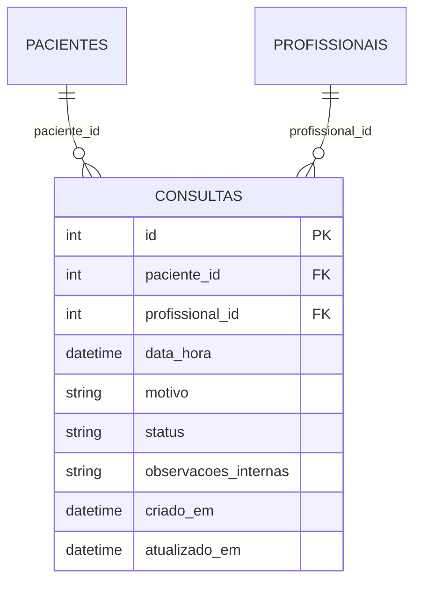

# Exercício 11 — Persistência segura

SQLModel substitui a memória no CRUD, na agenda HTML e na disponibilidade M2M. O requisito é banco relacional, queries parametrizadas, sessões injetadas e configuração por BaseSettings/`.env` (REQ-11, R18). **Recomendação de engenharia adotada:** SQLite em arquivo local, suficiente para a demonstração acadêmica; sem servidor de banco, camadas genéricas ou endpoints novos.

## Configuração e responsabilidades

| Arquivo | Responsabilidade |
| --- | --- |
| `app/settings.py` | `database_url` como `SecretStr`, leitura de `DATABASE_URL` do ambiente/`.env`; aceita somente arquivo SQLite local nesta versão |
| `.env.example` | `DATABASE_URL=sqlite:///.local/consultas.db`, caminho demonstrativo sem credenciais |
| `app/database/session.py` | Engine por lifespan, inicialização idempotente, FK habilitadas por conexão, sessão injetada e fechamento/rollback |
| `app/models/tabelas.py` | Tabelas internas de pacientes/profissionais/consultas, PK/FK/CHECK e timestamps UTC |
| `app/database/consultas.py` | Expressões SQLModel com valores vinculados; CRUD, filtro diário e conflito de agenda |
| `app/auth/policies.py` | Ownership com leitura pela mesma sessão, antes de expor ou alterar o recurso |
| `tests/test_persistencia.py` | Dezoito casos, incluindo reinício, integridade, parâmetros, rollback, concorrência, sessão e configuração |

SQLite não possui usuário/senha de conexão. Não inventar credenciais: o acesso ao arquivo depende das permissões do sistema operacional. A URL é configuração externa; o valor padrão é apenas um caminho local sem segredo. Configuração para PostgreSQL ou outro servidor exigirá decisão, driver e novos testes; não está implementada. **Nenhuma credencial real, `.env`, cadastro ou arquivo de banco deve entrar no repositório ou ZIP.**

O startup cria o diretório e tabelas ausentes e adiciona dois pacientes/dois profissionais fictícios apenas se seus IDs estiverem ausentes. Não limpa consultas nem sobrescreve os cadastros existentes. Contas/hashes continuam no arquivo confiável ignorado, vínculos continuam no cadastro estático do servidor; não foi criado CRUD de identidade. As chaves estrangeiras não substituem esse vínculo ou a autorização.

## Schema e tempo



PK identifica a consulta; FK impede referências inexistentes; CHECK limita status aos três estados, motivo a 3–255 caracteres e notas a 500. Colunas obrigatórias são NOT NULL. Pydantic continua validando o HTTP, separado da tabela; response models continuam excluindo campos internos. A rotina SQLModel usa `DateTime` explicitamente para armazenar UTC sem offset no SQLite, convertendo horários de entrada antes de gravar. Na resposta, `data_hora` passa a representar o mesmo instante com offset do fuso `America/Sao_Paulo`, inclusive para entradas originalmente sem offset. Filtros diários usam início inclusivo/fim exclusivo do dia local convertidos em UTC; não dependem do fuso do servidor.

## Queries e sessões

```python
query = select(ConsultaTabela).where(ConsultaTabela.paciente_id == paciente_id)
registros = session.exec(query).all()
```

O valor é vinculado pelo driver; não vira texto SQL. `session.get`, INSERT/UPDATE/DELETE do ORM e os demais filtros seguem o mesmo padrão. PRAGMA e BEGIN são comandos constantes sem entrada do usuário. Não há filtro textual novo apenas para mostrar SQL Injection. O teste envia um literal de ataque como motivo e verifica, pelo evento do driver, que ele aparece em parâmetros e não no SQL; IDs/filtros inteiros com operadores são rejeitados com 422. A tabela continua acessível, ownership continua obrigatório. Não foi encontrada uma SQL Injection anterior na aplicação em memória.

`SessionDep = Annotated[Session, Depends(get_session)]` fornece uma sessão por requisição. Escritas em consultas abrem `BEGIN IMMEDIATE` antes de qualquer leitura de ownership/conflito, e o CRUD confirma a transação. Falhas provocam rollback; `with Session` encerra a sessão, inclusive para 404/409. A engine é liberada no encerramento da aplicação. A única sessão usada por várias operações é a da própria requisição.

## Conflitos e concorrência

**Decisão de negócio aprovada (DEC-23):** intervalos de 30 minutos do mesmo profissional não podem se sobrepor. Cancelada libera; agendada/realizada bloqueiam. Intervalos adjacentes são permitidos. Criação, alteração de horário e reativação de cancelada verificam conflito, excluindo a própria consulta; profissional diferente pode usar o mesmo horário. Fora de expediente/fins de semana não são proibidos no CRUD: somente a disponibilidade possui esse recorte. Não acrescentar essa regra silenciosamente.

A reserva SQLite de escrita serializa as mutações desta API, inclusive entre conexões/processos que usam o mesmo arquivo. O segundo escritor só verifica o conflito depois de obter a reserva e ver o commit anterior. Verificar disponibilidade fora dessa transação não reservaria o horário. São testadas duas requisições concorrentes para criação e duas para atualização, com um sucesso e um 409 e apenas um intervalo persistido. Isso não mede capacidade nem comprova concorrência de outro motor.

O conflito gera 409 sem detalhes clínicos. SQLite BUSY/LOCKED após o timeout de cinco segundos gera 503 e `Retry-After`, sem SQL/caminho/credenciais. Outros erros inesperados continuam erros, não são convertidos em 404/409. Não há retry automático de mutação. A proteção de sobreposição é a transação mais a consulta na camada de dados; não existe constraint de exclusão no SQLite: escritores externos que contornem esta API podem violá-la. O banco deve ser acessado somente pela aplicação e por manutenção controlada.

## Migração e recuperação

A memória anterior era volátil e não contém dados duráveis a importar. O primeiro startup inicia banco vazio com os cadastros fictícios; evidências anteriores permanecem preservadas. `app/database/memoria.py` foi removido da aplicação final. Scripts históricos Ex. 2/6/7/9/10 devem ser executados no respectivo baseline Git, não contra o contrato atual nem sobrescrevendo evidências antigas. O baseline imediatamente anterior à migração é `27f385c` (Ex. 10). O script Ex. 8 tem seus próprios snapshots.

`create_all` cria tabelas ausentes; **não migra tabelas existentes**. Para futuras alterações de schema, definir migração explícita antes de usar banco existente. Reverter código não converte automaticamente SQLite em memória. Para recuperar uma demonstração, pare todos os processos e preserve cópia do arquivo antes de substituir ou remover dados. Não apagar o banco para resolver erros sem essa avaliação. Backup/restore automatizado, criptografia de disco, permissões/retenção operacionais e deploy não foram verificados; são riscos residuais, não funcionalidades entregues.

## Verificação e continuidade

Suíte integrada: **181 testes passaram**, dois avisos de dependências do TestClient. Reprodução: **13 observações HTTP em dois processos distintos**, criando no primeiro e lendo/alterando no segundo, com SQLite temporário, SQL parametrizado, ownership, HTML, M2M, conflito e remoção. Evidências em [Ex. 11](../evidencias/ex11/README.md). Payload XSS em status agora também é impedido pelo CHECK do banco; os testes de template projetam dado legado com mock explícito, sem enfraquecer a constraint. Não alegam persistência de status inválido no banco atual.

A parametrização SQLModel real fecha a pendência técnica de integração SQL dos Ex. 8/9; a aceitação acadêmica do ANTES didático, do cenário paciente e do endpoint adicional continua pendente. TM-009/010/015 passam a ter controles/testes de banco; TM-007 permanece sem trilha persistente de auditoria. Ex. 12/13 ainda precisam de pipeline, ZAP, auditoria e decisão de liberação.

Referências: [SQLModel — sessão como dependência](https://sqlmodel.tiangolo.com/tutorial/fastapi/session-with-dependency/) e [SQLAlchemy — comportamento transacional e foreign keys no SQLite](https://docs.sqlalchemy.org/en/20/dialects/sqlite.html). As verificações locais comprovam os cenários descritos, sem aprovação de deploy.
